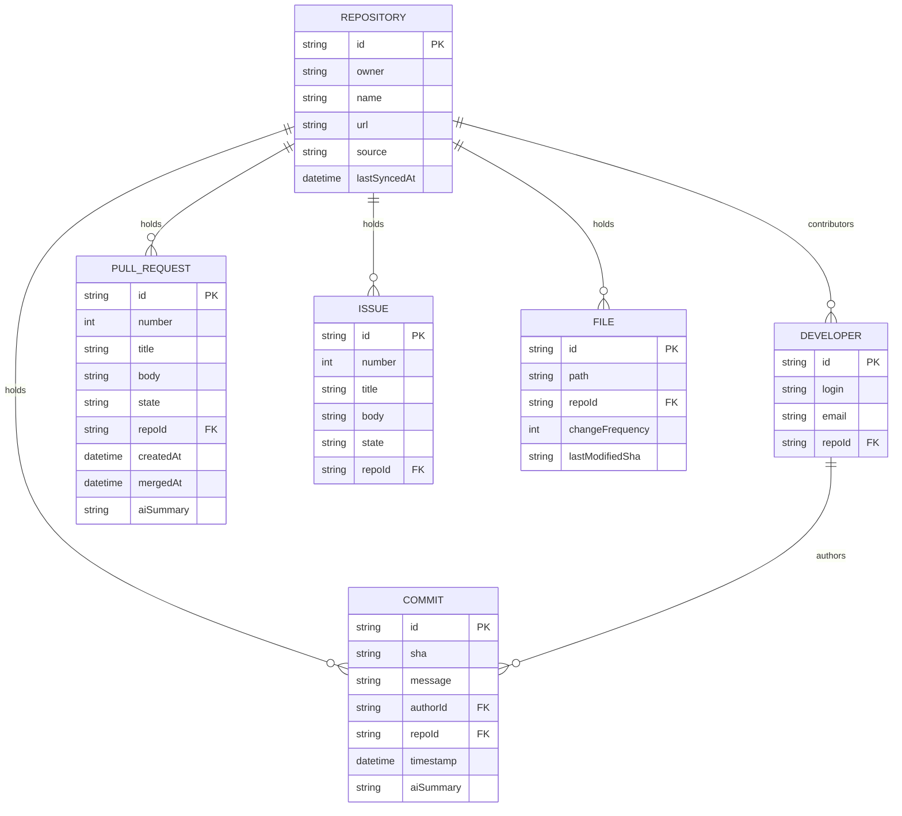

# System Architecture

This document describes the high-level architecture, module design boundaries, database layers, and pipeline integrations for the IntentSync system.

---

## 🏗 High-Level Top-Down Overview

```
                       ┌─────────────────────────┐
                       │       apps/cli          │
                       │    (Commander.js)       │
                       └────────────┬────────────┘
                                    │
          ┌─────────────────────────┼────────────────────────┐
          ▼                         ▼                        ▼
┌───────────────────┐    ┌────────────────────┐    ┌───────────────────┐
│     ingestion     │    │     retrieval      │    │      inspect      │
│  (Sync Pipeline)  │    │  (Hybrid Search)   │    │  (Diagnostics)    │
└─────────┬─────────┘    └──────────┬─────────┘    └─────────┬─────────┘
          │                         │                        │
          │     ┌───────────────────┼────────────────────────┘
          ▼     ▼                   ▼
┌───────────────────┐    ┌────────────────────┐
│      core /       │    │     embeddings     │ ◄── [Gemini API]
│      logger       │    │     (ChromaDB)     │
└─────────┬─────────┘    └──────────┬─────────┘
          │                         │
          ▼                         ▼
┌───────────────────┐    ┌────────────────────┐
│    repository-    │    │      database      │
│     provider     │    │  (Postgres Prisma) │
└─────────┬─────────┘    └──────────┬─────────┘
          │                         │
          ▼                         ▼
  [Local FS / GitHub]         [Postgres DB]
```

---

## ⚡ Core Philosophy: Retrieval-First → Graph-Enhanced

IntentSync operates under a strict priority pipeline:
1. **Raw Metadata & History extraction** forms the basic domain.
2. **Text Chunking & Semantic Vectors** forms the primary retrieval memory layer.
3. **Graph Relationships** (Neo4j) progressively layer over the database, serving to refine and augment semantic lookup queries rather than act as the entry point.

---

## 📦 Workspace Module Responsibilities

| Module Name | Dependency | Purpose & Boundary |
|---|---|---|
| `@intentsync/core` | *None* | Common TypeScript models, Zod schema environments, base result types, text chunking algorithms, and deterministic hashing utilities. |
| `@intentsync/logger` | *None* | High-performance JSON-based Pino logging with distinct colorized development consoles. |
| `@intentsync/repository-provider` | `core`, `logger` | Generic abstraction interface encapsulating either directory-based simple-git operations or GitHub network Octokit wrappers. |
| `@intentsync/db` *(Phase 3)* | `core`, `logger` | Schema definition and ORM compiler client pointing to PostgreSQL. |
| `@intentsync/embeddings` *(Phase 3)* | `core`, `logger` | Text indexing drivers calling Gemini embeddings, storing and querying chunks inside a vector database. |
| `@intentsync/retrieval` *(Phase 4)* | `core`, `db`, `embeddings` | Multi-source context ranker that extracts relevant records, aggregates them, and builds unified code memory frames. |
| `@intentsync/ai-engine` *(Phase 4)* | `core` | Context-aware chatbot wrappers, instruction builders, response formatting controls, and lazy summaries caching. |
| `@intentsync/graph` *(Phase 6)* | `core`, `logger` | Neo4j client that indexes logical relationships and co-change weights between commits, developers, and code modules. |

---

## 🧬 Relational Schema Layout (PostgreSQL & ChromaDB)

### PostgreSQL Domain Schema


### ChromaDB Collections (Vector Search)

We maintain collections to store dense, high-dimensional mathematical representations of each data model chunk:
* **`intentsync_commits`**: Stores overlapping text summaries of commit logs.
* **`intentsync_prs`**: Stores title & description summaries of pull requests.
* **`intentsync_issues`**: Stores ticket information to map development goals.
* **`intentsync_files`**: Stores file-level modification histories and pathway configurations.
